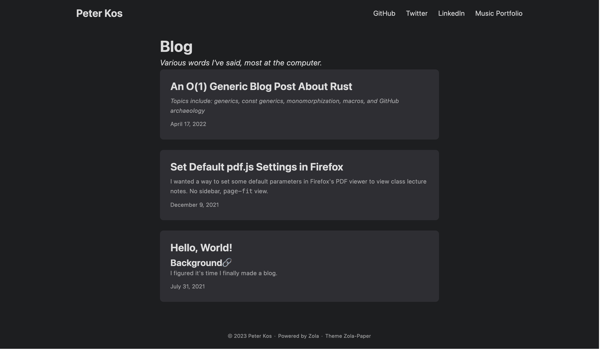

# peterkos.github.io
### version 5: yale inspired

This one was inpsired by Yale's webiste design, mainly because I was applying to transfer there in early 2019. (That didn't happen :sob:)

Anyways, here's a "current" screenshot of the site:

The `code` page is super not finished, but I'm pretty happy with how Music turned out.
